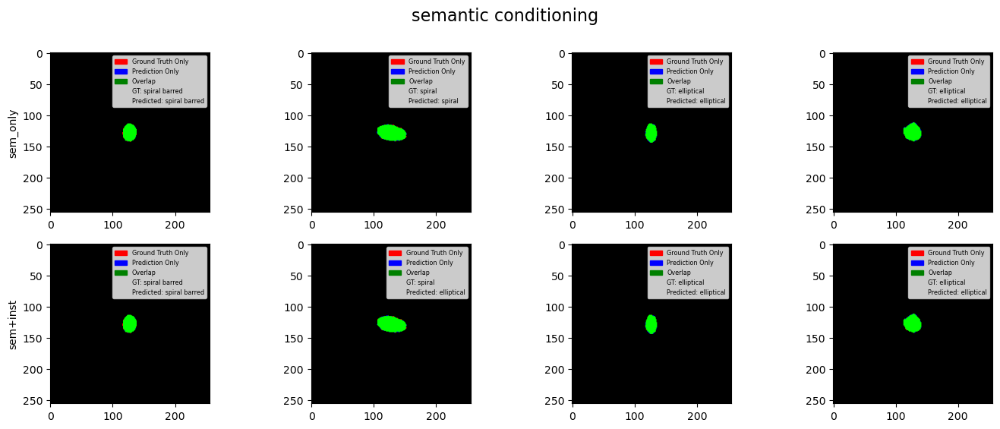

# Galaxy Segmentation with OneFormer over GalaxyZoo2
Universal segmentation over GalaxyZoo2
## Retrieve the dataset
The file `gz2_hart16.csv` contains the galaxyzoo2 catalog where each object has a label according to the categorization used by https://arxiv.org/pdf/1308.3496v2 (Appendix A).

The files `via_region_data.json` under `original/train` and `original/val` are taken from https://github.com/hfarias/mask_galaxy as also most of the dataset python objects in `src/dataset.py`.

The file `galaxy_segment_classes.json` contains the data used for training with the classes derived from galaxyzoo2 and is built with the notebook `data_conversion.ipynb`. 
From an initial aggregation, 15 classes are extracted, but the dataset results too unbalanced so an additional aggregation is performed.
The resulting classes are 5 with the following meaning:
5 categories
- A: star or artifact 
- E: Elliptical, which contains (c)igar-shaped, (i)n-between, (r)ounded
- S: Spiral, whic groups all bulge prominence (‘Sd’ = none, ‘Sc’ = just noticeable, ‘Sb’ = obvious, ‘Sa’ = dominant). 
- SB: Spiral Barred, which groups all barred with bulge prominence (‘SBd’ = none, ‘SBc’ = just noticeable, ‘SBb’ = obvious, ‘SBa’ = dominant).
- Se: Spiral edge-on disks, which groups all edge-on with bulge shape (‘Sen’ = none, ‘Seb’ = boxy, ‘Ser’ = rounded).

## About the model
The script `train_script.py` can be used to fine-tune the OneFormer model, the model card can be changed inside the script. It is also implemented to recover the training from a specific epoch/iteration.

Two models have been trained, one (<i>galaxy_sem_5_1</i>) conditioned only on the `semantic` task, the other (<i>galaxy_sem_inst_10_2</i>) on both `semantic` and `instance`.

The safetensors for the trained models can be downloaded from [here](https://drive.google.com/drive/folders/1x3SXW74haBaAwi-NyHYjjOkNX7fqH6Y0?usp=sharing), place them in a folder called `safetensors`.

The notebook `post_training.ipynb` is used to compute all the relevant metrics over the model, the same can be done using the script `compute_scores.py`.

### Training setting
|                            | **sem_only**          | **sem+inst**          |
|----------------------------|-----------------------|-----------------------|
| **Model card**              | ade20k_swin_tiny      | ade20k_swin_tiny      |
| **Learning rate**           | 1e-4                  | 1e-4                  |
| **Weight decay**            | 0.1                   | 0.1                   |
| **Gradient clipping**       | 1                     | 1                     |
| **Optimizer**               | AdamW                 | AdamW                 |
| **Scheduler**               | warmup+polynomial     | warmup+polynomial     |
| **# queries**               | 150                   | 150                   |
| **Epochs**                  | 5                     | 10                    |
| **Batch size**              | 1                     | 2                     |
| **Augmentations**           | h/v flip, rotation    | h/v flip, rotation    |

*Table: Training hyperparameters*

### Results
| **Type**       | **mIoU** | **Dice** | **Accuracy** | **AP .5:.95** |
|----------------|----------|----------|--------------|---------------|
| **sem_only**   | 0.6218   | 0.6539   | 0.7019       | 0.4012        |
| **sem+inst**   | 0.6399   | 0.6726   | 0.7118       | 0.1781        |

*Table: Evaluation metrics for both models. mIoU, Dice, and Accuracy were evaluated by conditioning on the `semantic` task, while AP was computed using the `instance` task.*

## Evaluation of the two trained 

*Figure: Comparison of both models on the same samples, conditioned on the `semantic` task.*

*Figure: Comparison of both models on the same samples, conditioned on the `instance` task.*
